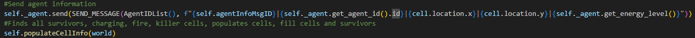
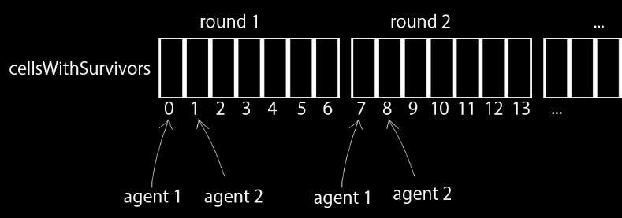
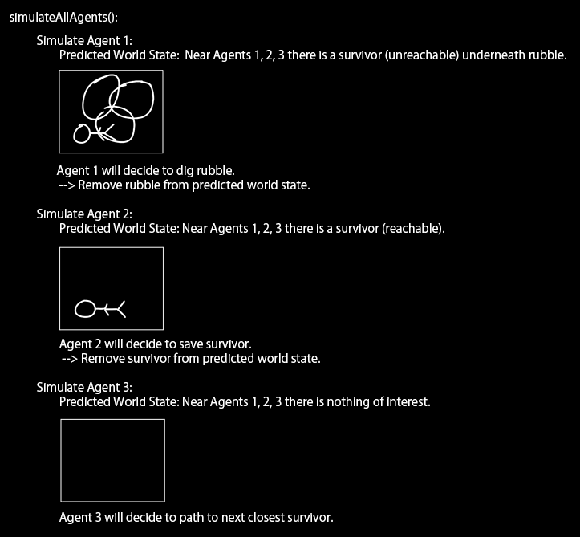

# 📊 AEGIS Multi-Agent Rescue AI (2025)
  
A self-coordinating AI built in Python for the University of Calgary’s multi-agent simulation platform AEGIS, designed to rescue survivors in a grid-based simulation with complex constraints like rubble removal, energy management, and significant communication delays.

---

### 🔧 Background
AEGIS is a multi-agent rescue simulation where multiple autonomous agents must collaborate to rescue survivors trapped in a hazardous grid world. Survivors may be trapped under rubble that requires multiple agents working simultaneously to clear, and agents have limited energy, requiring strategic use of charging stations. **Communication between agents is limited by a 1-turn delay in message passing.**

**Why it matters:**  
Designing systems that coordinate effectively under communication constraints reflects challenges in real-world robotics, distributed AI, and disaster response simulations. The system demonstrates agents capable of reasoning about and adapting to others’ future actions without explicit communication, enabling high-efficiency coordination.

---

### 🎯 Key Features  
- Multi-agent coordination under limited, delayed communication  
- Local simulation of all agents’ actions to create virtual shared memory  
- Energy management, pathfinding, and hazard navigation integrated into agent decision-making  
- Designed for optimal survivor rescue in minimal turns  

&nbsp;
# 🧠 Implementation Overview
🤖 **Simulated Shared Memory Across Agents**
- Agents synchronize knowledge once at the start of the mission.
- During the mission, agents do not communicate further, but locally simulate each other’s planned actions (and their results).
- This approach effectively eliminates communication delays and enables coordinated decision-making throughout the mission.

---

🎯 **Decision Logic and Agent Actions**
- Agents prioritize survivors based on proximity, rubble requirements, other agents' intentions, and self-preservation mechanics.  
- When rubble blocks a survivor, agents coordinate simultaneous rubble removal.  
- Energy is managed by routing agents to charging stations when current energy is predicted to be insufficient for the next goal.  
- Dynamic replanning occurs as simulated agent actions continuously update the locally predicted environment state.  
  
---

📅 **Precise Simulation via Execution Order Insight**  
- The simulation depends on faithfully reproducing the AEGIS client’s sequence of agent thinking and action phases.  
- Each agent simulates others’ decisions and moves in the exact order the client executes them, ensuring consistent world state.  
- This requires detailed understanding of the client’s internal processing cycle to prevent divergence between predicted and actual world state.

---

💻 **Integration with AEGIS API**
- Agents implement prescribed interface methods to read world state and issue actions.  
- Python data structures maintain local agent state and simulated plans.
- Runs within the official AEGIS client simulation environment.

&nbsp;
# 📚 Technical Writeup <sub><sup>(the interesting part!)</sup></sub>

### 1. Mission Start Synchronization

> <details>
> <summary>Click to Expand</summary>
>
> &nbsp;  
> At the start of each mission, agents send a single synchronization message containing all known states.  
>  
> *Some information can be gathered individually at no time cost by querying each cell on the map — critically, this includes whether there is a survivor on a given cell.*
> 
> Agents do not immediately move in round 1, as each agent’s local information is not yet consistent with that of the others. 
> *The synchronization message will arrive at the start of round 2, during the thinking phase.*  
>
> However, agents still have work to do before moving: gathering more information about cells which contain survivors.  
> *Since "OBSERVE" consumes a turn, agents must coordinate which survivor-containing cells they observe.*  
> 
> A unique cell containing a survivor is assigned to each agent without communication with the following formula:  
> `indexToObserve = (round-1)*numOfAgents+agentID-1`
>   
>
> The observed information about these cells with survivors (rubble information, number of survivors, etc) is messaged to all other agents.  
>
> When an agent’s indexToObserve exceeds the number of survivor-containing cells, it sends a message to all agents to end the synchronization stage (which will be received next round).
>
> This early-stage synchronization gives all agents a shared memory baseline, aligning each agent’s simulated world model.
> </details>

&nbsp;
### 2. Understanding AEGIS Execution Order
*Understanding the AEGIS client's internal execution cycle is critical to accurately simulating agents.*

> <details>
> <summary>Click to Expand</summary>
>
> &nbsp;  
> In AEGIS, agents do not act simultaneously. Each agent takes its turn in a defined execution order. This means that by the time one agent acts, other agents may have already moved or altered the world (e.g., moved rubble, rescued survivors, triggered dangers).
>
> Navigating this requires a deep understanding of the AEGIS simulation loop:  
> 1. Each agent goes through a **thinking phase** in ascending order based on their ID.  
> This is where our code is executed, as the AI file for each agent.  
> Agents are expected to send a single action, which will be executed during the **action phase**.  
>
> 2. Each agent goes through the **action phase** in ascending order based on their ID.  
> Agents will execute the action determined during the **thinking phase**. 
> 
> ```
> Round x Thinking Phase:
> 1. Agent 1 decides its next action: Dig Rubble
> 2. Agent 2 decides its next action: Save Survivor
> 3. ...
> 
> Round x Action Phase:
> 1. Agent 1 attempts to dig rubble.
> 2. Agent 2 attempts to save survivor.
> 3. ...
>
> Round x+1 Thinking Phase:
> ...
> ```
>
> **Because each agent's action is locked in during its thinking phase, no agent can react to the outcome of others' actions within the same round. As a result, accurate coordination requires pre-simulation.**
> </details>

&nbsp;
### 3. Simulating Other Agents’ Decisions  
*Locally simulating every other agent’s decisions within its own turn to circumvent communication delay.*  
> <details>
> <summary>Click to Expand</summary>
>
> With a clear understanding of the AEGIS execution order, we are now able to devise a strategy to bypass communication delays:  
> - Synchronize all agents with a single broadcast message at the start of the simulation.
> - On each subsequent turn, every agent independently simulates all agents' thought processes to decide their action, in the same order the client will execute them.
> - Since the world changes with each agent’s action, the simulated world state must be updated to reflect the impact of each simulated action. 
>   - The simulation of `agent 2` (by each agent) uses the world state that has been modified by the action simulated for `agent 1`  
> 
>   
> *This alignment between simulation and execution was only possible because we reverse-engineered the client’s update sequence. Without full knowledge of it, agent plans would rapidly desynchronize.*
>
> To summarize:  
> Each agent, on its own turn, executes the following steps:
> - For each agent (including self), simulate the decision making process for this agent's next action based on the simulated world state.
>   - This involves re-running our agent AI code as if we were that agent, using the current simulated world state, and predicting their chosen action.
> - Before moving onto simulating the next agent, update the simulated world state to reflect the changes as a result of the predicted action (even though the action has not yet been carried out within the AEGIS simulation!)
>
> This enables each agent to act with full knowledge of all others' intended moves — achieving perfect coordination without ongoing communication.
>
> Note:  
> It is important to simulate all agents — even those that move after the agent who is currently deciding their action — to keep the simulated world state accurate for the next turn.
> </details>

&nbsp;
### 4. Examples


> <details>
> <summary>Click to Expand</summary>
>
> - Agents identify rubble locations blocking survivors.
> - Simulation ensures the required number of agents arrive simultaneously to clear rubble, avoiding wasted turns.
> - Agents monitor energy reserves, preemptively routing to charging stations.
> - Simulation updates allow agents to replan if predicted energy usage or movement conflicts arise.
>
> This results in swift, uninterrupted rescue operations with minimal idle time.
> </details>

&nbsp;
### 5. Centralized Planning Pitfalls
*Why not a centralized leader?*
> <details>
> <summary>Click to Expand</summary>
>
> One possible approach would have been to assign one agent to plan all agents’ actions, then distribute them via messages.
> However, due to the 1-turn delay in message passing, this would result in every agent acting on outdated information.
> 
> Furthermore, in the event that information sharing between agents is required (information regarding previously-buried rubble), the delay would be even greater - one turn to reach the leader, and another for the leader's updated orders to reach all other agents.
> For example, even if the leader perfectly planned actions for all agents in turn `t`, they would only receive their instructions in turn `t+1` — at which point the world state has already changed.
> 
> This decentralized strategy avoids this delay by giving every agent the responsibility to make their own decisions at the start of each round.
> </details>

&nbsp;
# 🏆 Results & Impact

- Achieved **100% assignment score** with effective multi-agent coordination strategy.  
- Demonstrated drastically improved rescue efficiency compared to naïve communication models.  
- Eliminated the 1-turn message delay impact, enabling near real-time cooperation.  
- Provided a scalable pattern for coordination in other multi-agent systems with communication constraints.

&nbsp;
# 🧹 Caveats

### 📈 Scalability Considerations  
Simulating all agents' actions sequentially leads to quadratic computational complexity as the number of agents grows. In our project scope (small teams), performance remained efficient and met all timing requirements.  
- This strategy enabled full knowledge and coordination, trading off raw scalability for precision and simplicity.  
- For larger-scale systems, techniques such as grouping agents based on spatial proximity or task compartmentalization could allow agents to simulate only their local group members, significantly reducing computational overhead and eliminating quadratic scaling while preserving coordination.

---

### 🤖 Dependence on Consistent Agent Logic  
The simulation assumes all agents run identical decision-making logic based on shared state. This ensured seamless synchronization and predictable behavior, vital for successful coordination.  
- This makes the strategy difficult to apply in heterogeneous systems where agents have different behaviors or logic, as inconsistent decision-making models would break the simulation’s assumptions.

---

### 🎯 Mostly Deterministic World Model  
The project leveraged AEGIS’s almost fully deterministic environment to achieve accurate multi-agent simulations. This enabled precise predictions of agent interactions and outcomes, forming the basis for our innovative communication-free coordination.  
- While real-world uncertainty poses additional challenges, mastering deterministic coordination lays important groundwork for future extensions into probabilistic and dynamic scenarios.

---

### 🔄 Limited Synchronization Points  
Currently, agents synchronize all shared information once at the start of each mission round via a single message.  
- This design minimizes communication overhead and enables efficient simulation of agent actions throughout the round.  
- For scenarios where agents might diverge in knowledge, adding periodic synchronization points could improve robustness without sacrificing too much efficiency.

&nbsp;
# 🧠 Lessons Learned

### 🤖 Leveraging Agent Simulation for Coordination  
Simulating other agents’ planned actions locally allowed us to bypass the 1-turn communication delay inherent in AEGIS. 
- This insight was critical in enabling real-time coordination and multi-agent tasks like rubble removal.
- In practice, this meant agents could anticipate teammates’ moves and avoid costly idle time or conflicts.
- This paradigm highlights the power of predictive internal models in distributed AI systems facing communication constraints.

---

### 🔍 Handling Partial Observability and Uncertainty  
While our system leveraged AEGIS’s mostly deterministic environment, the presence of hidden survivors and rubble information forced agents to act cautiously and rely on synchronized knowledge. 
- This experience underscored the importance of designing AI systems that can balance risk and information gaps — a core challenge in real-world robotics and disaster response.
  
---

### 🗣️ Tailoring Communication Protocols to Latency and Bandwidth Constraints  
The imposed 1-turn delay forced us to heavily prioritize what information was shared and when. 
- Sending a single synchronization at the start of each mission, combined with local simulations, struck a balance between communication overhead and up-to-date coordination.
- This tradeoff demonstrated that communication design must be tightly integrated with scenario's timing and computational constraints.
  - In this case, we had an abundance of computation available, but a very harsh latency in traditional communication.
  - Thus, we were able to use computation instead of message sending to make up for the vast majority of communication that needed to take place.
  
---

### 🧩 Deep Understanding of Execution Order is Crucial  
Reverse-engineering the AEGIS client’s update cycle was essential to ensuring all agents’ internal simulations aligned with actual actions, preventing divergence.
- This reflects the importance of intimate system knowledge when designing tightly-coupled multi-agent coordination schemes.

&nbsp;
# ⚙️ How to Run
**This is not recommended - read the [Technical Writeup](#-technical-writeup-the-interesting-part) instead if you haven't already!*
> <details>
> <summary>Click to expand</summary>
> 
> This repo contains only the agent code. To run it, you must install the [AEGIS simulator](https://cpsc-383.github.io/aegis/) locally.
> 
> 1. Follow the installation guide on the [AEGIS website](https://cpsc-383.github.io/aegis/mas/getting-started/installation/)
> 2. Place this repo’s `exampleagent.py` file in the appropriate agents directory  
> *Although the file is named exampleagent.py, it is the exact agent code as described in this writeup.*  
> *It was edited to reduce the steps needed to run, as the AEGIS client we worked with references exampleagent.py by default.*
> 3. Run the AEGIS simulation via the official client with a test world
> </details>
